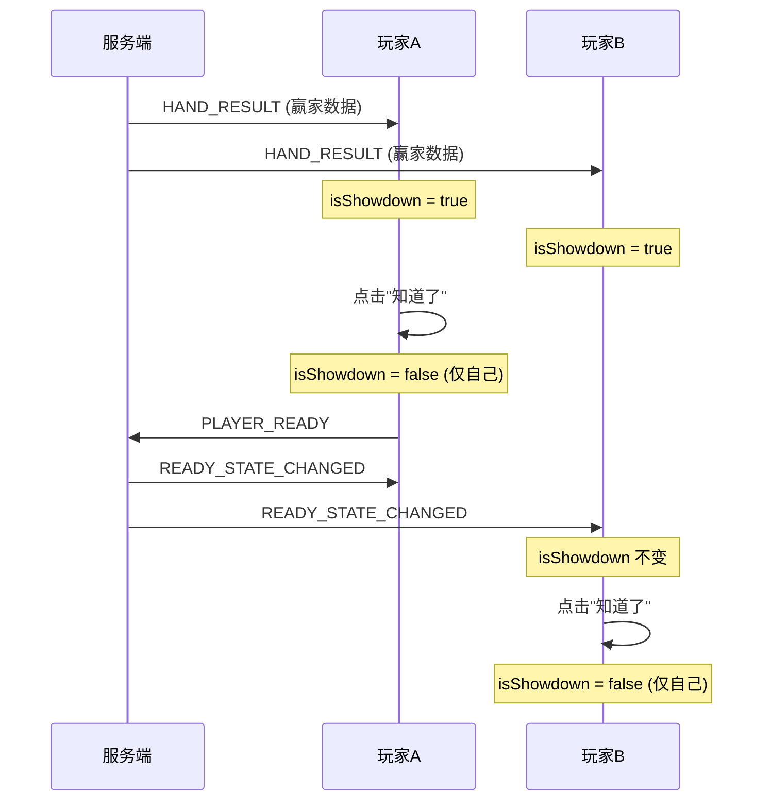

# Showdown 状态模型

## 一、状态分类

| 状态 | 类型 | 说明 |
|------|------|------|
| `handResult` | 房间级只读 | 结算数据（赢家、底池、亮牌） |
| `isShowdown` | 玩家本地 UI | 控制弹框显示与否 |

## 二、状态流转



## 三、关键实现

### 3.1 useSocket.ts

```typescript
// 本地 UI 状态
const isShowdown = ref(false);

// 收到结算 → 显示弹框
socket.on('HAND_RESULT', (data) => {
    handResult.value = data;
    isShowdown.value = true;
});

// 新一局开始 → 自动关闭
socket.on('SYNC_STATE', () => {
    isShowdown.value = false;
    handResult.value = null;
});
```

### 3.2 App.vue

```typescript
const closeShowdown = () => {
    isShowdown.value = false;  // 仅修改本地
    playerReady();              // 发送准备
};
```

## 四、验证标准

- ✅ 玩家A点击关闭不影响玩家B
- ✅ 新一局开始后所有人弹框自动关闭
- ✅ 结算数据是只读的房间级数据
