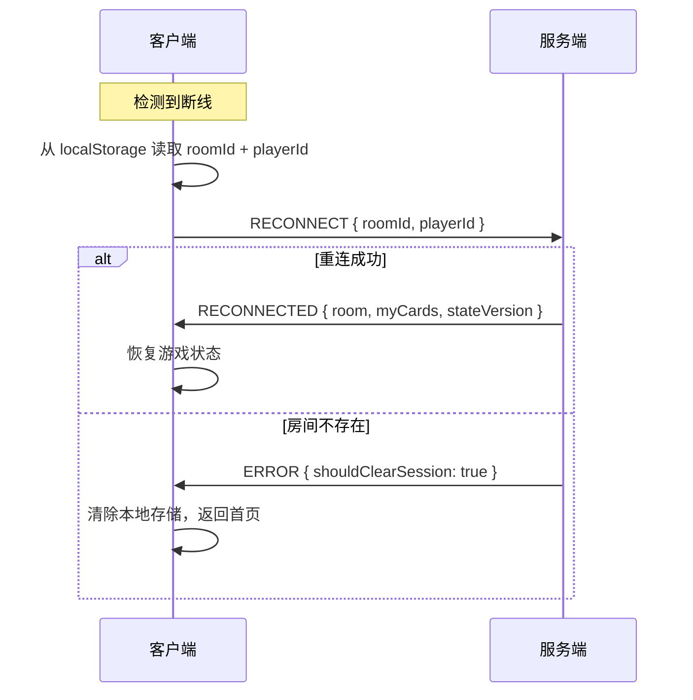

# 🔌 WebSocket 协议设计文档

> Pocket Holdem MVP - 客户端/服务端通信协议规范

---

## 📌 基础约定

### 连接地址
```
ws://localhost:3000
```

### 消息格式
所有消息均为 JSON 格式，包含以下通用字段：

| 字段 | 类型 | 必填 | 说明 |
|------|------|------|------|
| `type` | string | ✅ | 事件类型（详见下文） |
| `requestId` | string | 客户端发送时必填 | 请求唯一 ID（UUID），用于幂等去重 |
| `stateVersion` | number | 服务端返回时包含 | 状态版本号，客户端用于判断是否过期 |

---

## 📤 客户端 → 服务端 消息

### 1. CREATE_ROOM - 创建房间

```json
{
  "type": "CREATE_ROOM",
  "requestId": "uuid-xxx",
  "hostNickname": "Alice",
  "config": {
    "initialChips": 1000,
    "smallBlind": 10,
    "bigBlind": 20,
    "maxPlayers": 6,
    "turnTimeout": 30
  }
}
```

### 2. JOIN_ROOM - 加入房间

```json
{
  "type": "JOIN_ROOM",
  "requestId": "uuid-xxx",
  "roomId": "123456",
  "nickname": "Bob",
  "playerId": "可选，用于重连"
}
```

### 3. SIT_DOWN - 坐下

```json
{
  "type": "SIT_DOWN",
  "requestId": "uuid-xxx",
  "seatIndex": 0
}
```

### 4. STAND_UP - 站起

```json
{
  "type": "STAND_UP",
  "requestId": "uuid-xxx"
}
```

### 5. START_GAME - 开始游戏（仅房主）

```json
{
  "type": "START_GAME",
  "requestId": "uuid-xxx"
}
```

### 6. PLAYER_ACTION - 玩家操作

```json
{
  "type": "PLAYER_ACTION",
  "requestId": "uuid-xxx",
  "action": "FOLD | CHECK | CALL | RAISE | ALL_IN",
  "amount": 100,
  "roundIndex": 1
}
```

> **注意**：`roundIndex` 必须与服务端当前值匹配，否则被视为过期请求

### 7. RECONNECT - 断线重连

```json
{
  "type": "RECONNECT",
  "requestId": "uuid-xxx",
  "roomId": "123456",
  "playerId": "player-uuid"
}
```

### 8. LEAVE_ROOM - 离开房间

```json
{
  "type": "LEAVE_ROOM",
  "requestId": "uuid-xxx"
}
```

---

## 📥 服务端 → 客户端 消息

### 1. ROOM_CREATED - 房间创建成功

```json
{
  "type": "ROOM_CREATED",
  "room": { /* PublicRoomInfo */ },
  "myPlayerId": "player-uuid",
  "stateVersion": 0
}
```

### 2. ROOM_JOINED - 加入房间成功

```json
{
  "type": "ROOM_JOINED",
  "room": { /* PublicRoomInfo */ },
  "myPlayerId": "player-uuid",
  "isReconnect": false,
  "stateVersion": 0
}
```

### 3. PLAYER_JOINED - 有玩家加入（广播）

```json
{
  "type": "PLAYER_JOINED",
  "room": { /* PublicRoomInfo */ },
  "newPlayerId": "player-uuid",
  "stateVersion": 1
}
```

### 4. PLAYER_SAT - 玩家入座（广播）

```json
{
  "type": "PLAYER_SAT",
  "room": { /* PublicRoomInfo */ },
  "playerId": "player-uuid",
  "seatIndex": 0,
  "stateVersion": 2
}
```

### 5. GAME_STARTED - 游戏开始（广播）

```json
{
  "type": "GAME_STARTED",
  "room": { /* PublicRoomInfo */ },
  "stateVersion": 3,
  "handId": "hand-uuid"
}
```

### 6. DEAL_CARDS - 发牌（仅发给自己）

```json
{
  "type": "DEAL_CARDS",
  "holeCards": [
    { "suit": "SPADES", "rank": 14 },
    { "suit": "HEARTS", "rank": 10 }
  ],
  "stateVersion": 4,
  "handId": "hand-uuid"
}
```

### 7. PLAYER_TURN - 轮到行动（广播）

```json
{
  "type": "PLAYER_TURN",
  "playerIndex": 2,
  "timeout": 1703750000000,
  "stateVersion": 5
}
```

### 8. PLAYER_ACTED - 玩家已行动（广播）

```json
{
  "type": "PLAYER_ACTED",
  "room": { /* PublicRoomInfo 含最新状态 */ },
  "stateVersion": 6
}
```

### 9. SYNC_STATE - 状态同步（广播）

用于阶段推进、断线恢复等场景：

```json
{
  "type": "SYNC_STATE",
  "room": { /* PublicRoomInfo */ },
  "stateVersion": 7,
  "handId": "hand-uuid",
  "roundId": "round-uuid"
}
```

### 10. HAND_RESULT - 手牌结算（广播）

```json
{
  "type": "HAND_RESULT",
  "winners": [
    {
      "playerId": "xxx",
      "nickname": "Alice",
      "amount": 300,
      "handRank": "葫芦",
      "cards": [/* 手牌 */]
    }
  ],
  "pots": [{ "amount": 300, "eligiblePlayerIds": [] }],
  "showdownCards": [
    { "playerId": "xxx", "cards": [/* 手牌 */] }
  ],
  "stateVersion": 8,
  "handId": "hand-uuid"
}
```

### 11. GAME_ENDED - 游戏结束（广播）

```json
{
  "type": "GAME_ENDED",
  "room": { /* PublicRoomInfo */ },
  "winner": {
    "playerId": "xxx",
    "nickname": "Alice",
    "amount": 6000
  },
  "stateVersion": 9
}
```

### 12. RECONNECTED - 重连成功

```json
{
  "type": "RECONNECTED",
  "room": { /* PublicRoomInfo */ },
  "myPlayerId": "player-uuid",
  "myCards": [/* 手牌，如果游戏中 */],
  "stateVersion": 10,
  "handId": "hand-uuid",
  "roundId": "round-uuid"
}
```

### 13. ERROR - 错误消息

```json
{
  "type": "ERROR",
  "code": "NOT_YOUR_TURN",
  "message": "不是您的回合",
  "shouldClearSession": false
}
```

---

## 🔄 状态版本控制

### 客户端处理规则

```typescript
// 接收到服务端消息时
function handleServerMessage(msg) {
  // 1. 检查版本
  if (msg.stateVersion < localState.stateVersion) {
    console.log('忽略过期消息');
    return;
  }
  
  // 2. 更新本地版本
  localState.stateVersion = msg.stateVersion;
  
  // 3. 处理消息
  processMessage(msg);
}
```

### requestId 使用

```typescript
// 发送请求时生成唯一 ID
async function sendAction(action: string, amount?: number) {
  const requestId = crypto.randomUUID();
  
  socket.emit('PLAYER_ACTION', {
    action,
    amount,
    roundIndex: gameState.roundIndex,
    requestId
  });
  
  // 可选：本地缓存，避免重复发送
  pendingRequests.add(requestId);
}
```

---

## ⏱️ 超时处理

### 服务端行为
- 每个玩家行动有 30 秒超时
- 超时自动执行：
  - 无需跟注 → 自动 CHECK
  - 需要跟注 → 自动 FOLD

### 客户端处理

```typescript
// 收到 PLAYER_TURN 时
function onPlayerTurn(msg) {
  if (msg.playerIndex === myPlayerIndex) {
    // 是我的回合
    const timeoutMs = msg.timeout - Date.now();
    
    // 显示倒计时
    startCountdown(timeoutMs);
    
    // 启用操作按钮
    enableActionButtons();
  } else {
    // 不是我的回合
    disableActionButtons();
  }
}

// 收到 PLAYER_ACTED 时停止倒计时
function onPlayerActed(msg) {
  stopCountdown();
}
```

---

## 🔌 断线重连

### 流程



### 客户端实现

```typescript
// 连接断开时
socket.on('disconnect', () => {
  // 显示断线提示
  showReconnecting();
  
  // 自动重连（socket.io 内置）
});

// 重连成功时
socket.on('connect', () => {
  const session = localStorage.getItem('pokerSession');
  if (session) {
    const { roomId, playerId } = JSON.parse(session);
    socket.emit('RECONNECT', { roomId, playerId });
  }
});
```

---

## 📊 PublicRoomInfo 结构

```typescript
interface PublicRoomInfo {
  id: string;                  // 房间号
  hostId: string;              // 房主 ID
  config: {
    initialChips: number;
    smallBlind: number;
    bigBlind: number;
    maxPlayers: number;
    turnTimeout: number;
  };
  players: PublicPlayerInfo[]; // 玩家列表
  gameState: PublicGameState | null;
  isPlaying: boolean;
  createdAt: number;
}

interface PublicPlayerInfo {
  id: string;
  nickname: string;
  seatIndex: number | null;
  chips: number;
  status: string;
  currentBet: number;
  isDealer: boolean;
  isCurrentTurn: boolean;
  hasActed: boolean;
  isFolded: boolean;
  isAllIn: boolean;
  isHost: boolean;
}

interface PublicGameState {
  phase: string;
  communityCards: Card[];
  pots: Pot[];
  currentPlayerIndex: number | null;
  dealerIndex: number;
  smallBlindIndex: number;
  bigBlindIndex: number;
  currentBet: number;
  minRaise: number;
  roundIndex: number;
  turnTimeout: number;
  stateVersion: number;
  handId: string;
  roundId: string;
}
```

---

## 🎮 典型对局流程

```
1. 玩家A CREATE_ROOM → ROOM_CREATED
2. 玩家B JOIN_ROOM → ROOM_JOINED (广播 PLAYER_JOINED)
3. 玩家A SIT_DOWN → PLAYER_SAT
4. 玩家B SIT_DOWN → PLAYER_SAT
5. 玩家A START_GAME → GAME_STARTED
6. 玩家A/B 各自收到 DEAL_CARDS
7. PLAYER_TURN → 玩家A行动
8. 玩家A PLAYER_ACTION CALL → PLAYER_ACTED
9. PLAYER_TURN → 玩家B行动
10. ... 重复直到摊牌
11. HAND_RESULT → 结算
12. (自动开始新手牌或 GAME_ENDED)
```
